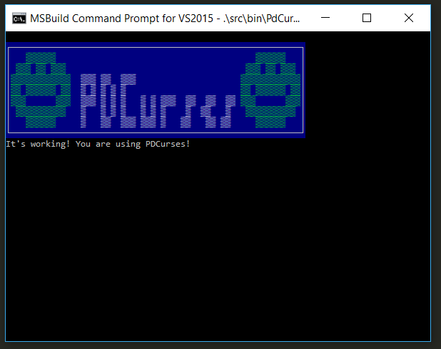

# About

A short demo using PDCurses in a Windows terminal via the conan package manager to get PDCurses



# Requirements

* CMake 3.2+
* C++ Compiler, likely visual studio build tools
* python 3 and pip (to install the conan package manager)
* Additional requirement, PDCurses, will be installed by conan

## Installing requirements

### CMake
CMake is a build system that generates build files for a system's native build
tools.

```shell
sudo apt install cmake
```

### conan
Conan is a C/C++ package manager system.  It runs under Python 2 or 3 and is
available in PyPI.  But, Python 2 will soon not be supported by the Python
devleopers, so use of 3 is recommended.

```shell
pip3 install conan
```

And bintray respository for pdcurses will need to be set up:

    $ conan remote add alexwarrior-conan https://api.bintray.com/conan/alexwarrior-org/alexwarrior-conan


The requirements as set up in the file conanfile.txt can be compiled and installed in the user home directory as:

    $ cd build
    $ conan install ..

If building for a 32-bit x86 machine, you might need to specify the platform as:

    $ conan install .. -s arch=x86


# Building

To build the project files to compile this:

    $ cd build
    $ cmake .. -G "Visual Studio 14 2015 Win64"
    $ cmake --build .

Adjusting the output project file as necessary depending on the version of visual studio to build for.  Then the project can be built as...

    $ msbuild /p:Configuration=Release Project.sln
